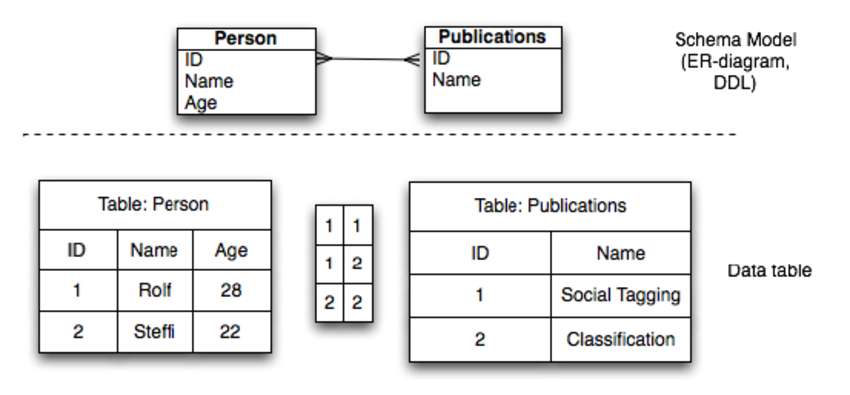

# Database - Knex

## Introduction

(Feel free to skip introduction if you already know about SQL databases. )

Database are an import part of backend, it's simply a piece of software that stores and retrieve data. In recent years databases have seen a lot of revolution we have a lot of options for the type of a database, most basic type of division in database are **SQL** and **No SQL**, SQL databases are table based databases whereas NoSQL databases can be document based, key-value pairs, graph databases. In this tutorial we'll focus on SQL database. 

Example of SQL database showing database that stores data of **Published Research Papers** and **Person** who wrote it -



The bottom half of the image shows an actual database with data, we have 2 tables `Person` and `Publication` , person has `Name` and `Age` of a person and also an `ID` that can help distinguish between people with same `Name` and `Age` . 
And publication has a `Name` i. e. title of the research paper and a unique `ID` of paper as was for person. 

The box/table between those two table represent the relation of which user published which paper, paper 1 was published by user 1 and paper 2 by user 1 and user 2 combined. 

On the top half we have a `database schema` , a diagram to reprent what will our database have, we se two tables, columsn of those tables and a line connecting ID of those two table representing the relationship between them. 

We won't go into depth of SQL databse as it is covered in other tutorials nicely. 

## Interfacing database to JS

These three are main ways to use a database with any language. 

1. Raw SQL queries - There is already a native langugage for relational databases, Structured Query Langugage aka SQL, we can make a string in JS that holds SQL commands and send it to DB, we'll recieve the results. This is **most powerful** method but can bring in **security issues** and **hard to read** code.
1. ORM(Object Relation Mapper) - 
1. Query Builder - 

## Knex
Knex.js is a "batteries included" SQL query builder for PostgreSQL, CockroachDB, MSSQL, MySQL, MariaDB, SQLite3, Better-SQLite3, Oracle, and Amazon Redshift designed to be flexible, portable, and fun to use.

## What we'll make??
To demonstrate how to insert, retrieve and update data into a database we'll create a todo app, where you can add items to your todo list, and mark them done. 
[Deletion of data is left as an exercise]

## Some coding

### 1. Setting up the DB

Install dependencies

`yarn add koa nodemon knex sqlite3` 

also install knex globally
`yarn global add knex` 

in the root of project create `knexfile.js` with below content

``` js
const CONFIG = {
    client: 'sqlite3',
    connection: {
        filename: './dev.sqlite3'
    },
    migrations: {
        directory: ['db/migrations']
    }
}

module.exports = CONFIG
```

create a file `db/knex.js` , with below content. 

``` js
const config = require('../knexfile')
const knex = require('knex')
module.exports = knex(config)
```

now create folders 'db/migrations'
create a migrations, with below commands. 

``` console
$ knex migrate:make create_todo_table
```

this will create a migrations file for you under `db/migrations` with some code. 
initially it'll contain code as follows

``` js
exports.up = function(knex) {};

exports.down = function(knex) {};
```

There are two functions, up is run when a migrations is applied and down is used when a migration is removed/undone. 

Add the following changes to the file

``` js
exports.up = function(knex) {
    return knex.schema.createTable('todo', function(table) {
        table.increments()
        table.string('name').notNull()
        table.boolean('is_done').defaultTo('false').notNull()
    })
};

exports.down = function(knex) {
    return knex.schema.dropTable('todo');
};
```

In the up function, we are creating a table using method `knex.schema.createTable` method which takes name of table (here `todo` ) and a callback function that describes columns in the table. 
`table.increments()` is creating a unique id column. 

In the `down` method we are simply deleting a table with method `knex.schema.dropTable` that takes the name of table. 

Now run the migrate command and you'll see db. sqlite3 file being created. 

``` console
$ knex migrate:up

Batch 1 ran the following migrations:
20200427034319_create_todo_table.js
```

### Setting up our web app

Add following `"scripts": { "dev": "nodemon app.js" }` in `package.json` , it should look like

``` json
....  
  "dependencies": {
    "knex": "^0.21.0",
    "koa": "^2.11.0",
    "nodemon": "^2.0.3",
    "sqlite3": "^4.1.1"
  },
  "scripts": {
    "dev": "nodemon app.js"
  }
...
```

create app. js with following content

``` js
const Koa = require('koa')
const db = require('./db/knex')
const app = new Koa()

app.use(async ctx => {
    ctx.body = `
        <form method="GET" action="">
        <h3>New todo<h3>
        <input type="text" name="name" />
        <input type="submit" value="Add" />
        </form>
        <form method="GET" action="">
            <h3>Todos:</h3>
                <input type="checkbox" name="id" value="1"/>Sample task<br />
                <input type="checkbox" name="id" value="2"/>Sample task 2<br />
            <input type="submit" value="Complete" />
        </form>
        
    `
})

app.listen(3000, () => console.log('Listening on port 3000'))
```

Everything is as usual except a new import named `knex` . `ctx.body` that has a form to add an item to the list, and we have a dummy todo list with a `Sample task` . 

Test a sample query, add this in `app.js` and refresh your browser

``` js
const todos = await knex.select().from('todo')
console.log(todos)
ctx.body = `
```

we are selecting(retrieving) data from table `todo` , you'll see `[]` in your console as there are no todos in the db. 

So let's add code to insert a todo. 

``` js
app.use(async ctx => {
                const name = ctx.query.name
                if (name !== undefined)
                    await knex('todo').insert({
                        name
                    })
```

`name` sent by pressing `Add` button on webpage, is stored in variable `name` , if it is not undefined we store it into todo table. 

Insert something in the input field and press `Add` button, you'll see this in the console

``` js
[{
    id: 1,
    name: 'adsa',
    is_done: 0
}]
```

[ refreshing the page will just add duplicate copies of same todo, so avoid it ]

#### Showing todos in the webpage 

Now we'll add a templating engine, 
refere to [this tutorial](https://google.com) and try to add a template yourself that replaces `ctx.body = ...` with `ctx.render` , then scroll through my steps below. 

Install dependencies

``` console
$ yarn add koa-views ejs
```

Add middleware to our app

``` js
const path = require('path')
const views = require('koa-views')

const app = new Koa()
app.use(views(path.join(__dirname, '/views'), {
    extension: 'ejs'
}))
```

create a template by, creating a file `views/index.ejs` with content of ctx. body i. e. 

``` html
<form method="GET" action="">
    <h3>New todo<h3>
            <input type="text" name="name" />
            <input type="submit" value="Add" />
</form>
<form method="GET" action="">
    <h3>Todos:</h3>
    <input type="checkbox" name="id" value="1" />Sample task<br />
    <input type="checkbox" name="id" value="2" />Sample task 2<br />
    <input type="submit" value="Complete" />
</form>
```

use `ctx.render` method in `app.js` 

``` js
console.log(todos)
await ctx.render('index', { todos })
```

Now refresh the browser if everything went fine you won't see any changes, let's update the template and remove `Sample task`, we can access the data by `todos` variable name inside the template try to do it yourself then see my code below.
```html
<h3>Todos:</h3>
    <% for(let todo of todos){ %>
        <input 
            type="checkbox" 
            name="id" 
            value="<%= todo.id %>" 
        />
        <%= todo.name %>
        <br />
    <% } %>
    <input type="submit" value="Complete" />
```

Refresh your browser and voila, we are almost done, now you can add todos and see them in your browser.
There is one tiny detail remaining though to mark the todos as done. 


#### Update todos 
We'll now take the query parameter id i.e. an array of id, then for each id in the array we'll set `todo.is_done = 1` and `todo.is_done = 0` otherwise.

below is final code to achieve this behaviour.
```js
const name = ctx.query.name
let selectedTodos = ctx.query.id
if (selectedTodos !== undefined) {
    // check if selectedTodos is an array,
    // if not make it an array
    if(!Array.isArray(selectedTodos))
        selectedTodos = Array(selectedTodos)
    
    // for selected todos
    await knex('todo')
            .update('is_done', 1)
            .whereIn('id', selectedTodos)
    
    // for unselected todos
    await knex('todo')
            .update('is_done', 0)
            .whereNotIn('id', selectedTodos)
}
```
This looks a bit complex but is very simple,
```js
let selectedTodos = ctx.query.id
```
We load the id from query param to a variable `selectedTodos`

```js
await knex('todo')
        .update('is_done', 1)
        .whereIn('id', selectedTodos)
```
Each selected todo is present in the array `selectedTodos`, so we are updating `is_done` to `1` for each todo/row where `id` in the array `selectedTodos`, using the method whereIn

Similarly we used method `whereNotIn` to set `is_done` to `0`

```js
if(!Array.isArray(selectedTodos))
        selectedTodos = Array(selectedTodos)
```

and finally we have an edge case, when only one id is selected `selectedTodos` will be a number not an array, so we shall create an array of single element if that's the case.

Finally a last touch is remaining, todo with `is_done` = 1 should be selected by default, following index.ejs will solve that issue.

```HTML
<input 
    type="checkbox" 
    <%= todo.is_done === 1 ? "checked" : "" %> 
    name="id" 
    value="<%= todo.id %>" 
/>
```


### What next?
Try to make this app a bit better by doing the following -
1. Add option to delete a todo.
1. Actually cross out an todo (using del tag in the template)
1. Put done todos at the last (i.e. sort by is_done).
1. Add option to edit text of a todo.

Besides this you can explore [knex.js docs][http://www.knexjs.org/]
